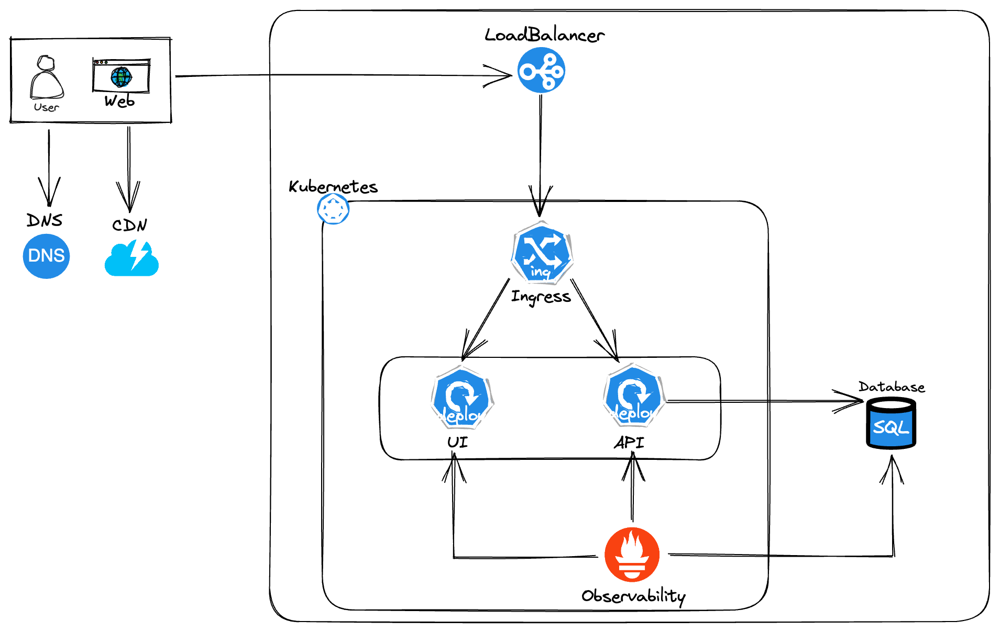
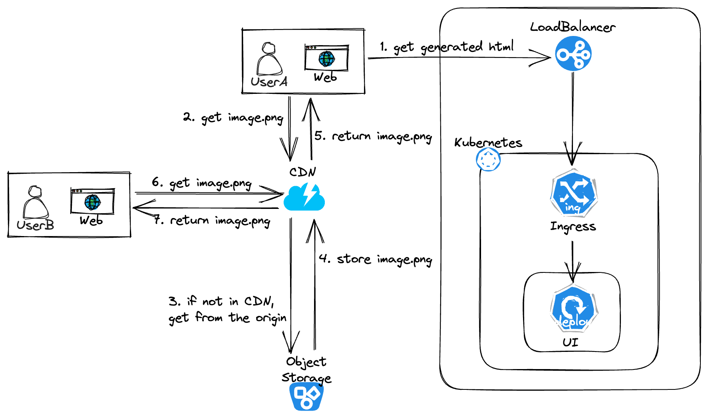
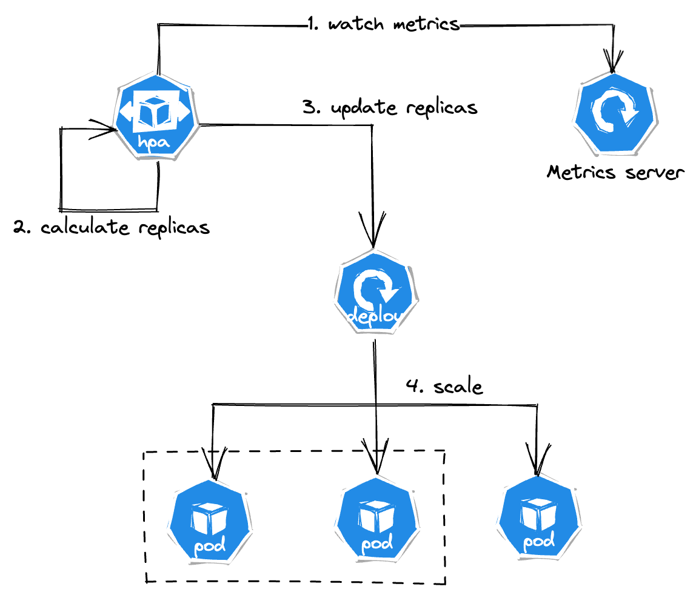
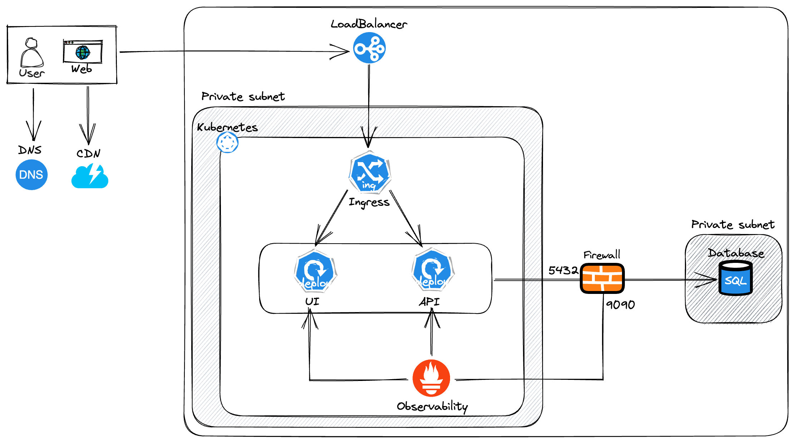
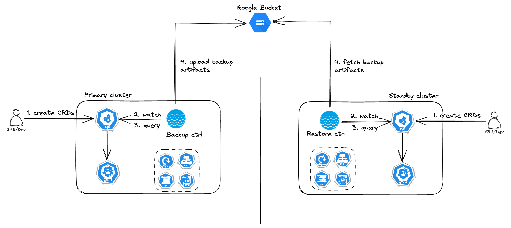
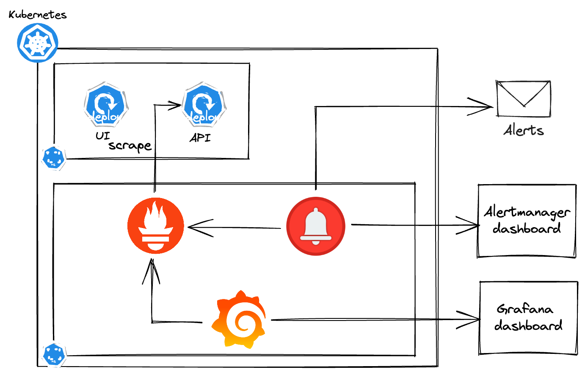
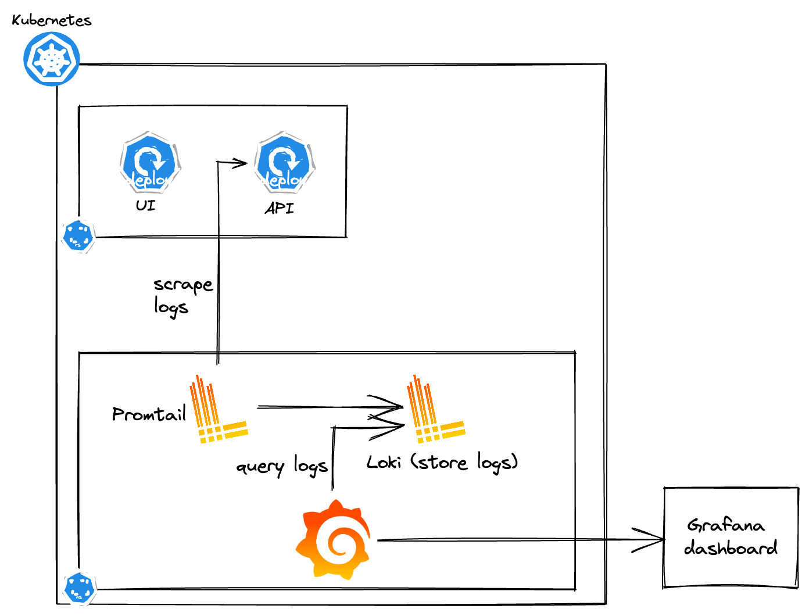
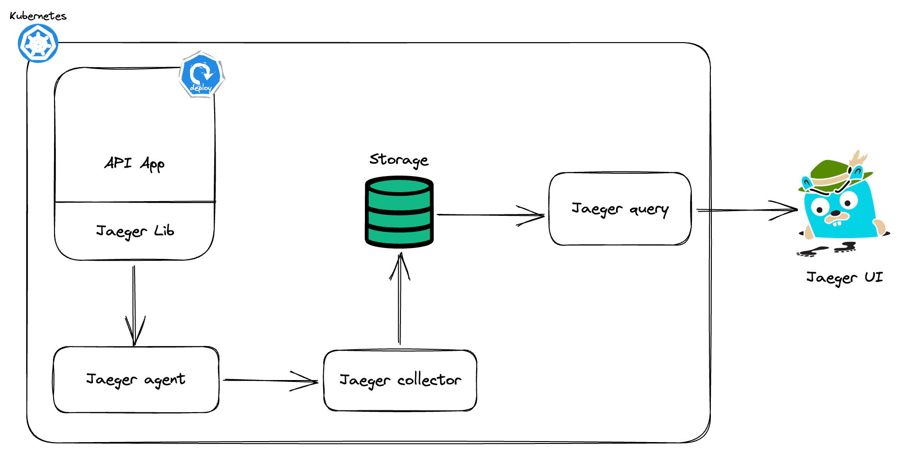

# Creative Force's Test Challenge


# Problem and design scope
Design the cloud infrastructure for a new service. The service is composed of multiple components, each of which comes packaged in a docker image. The components are:

- UI: A user interface served as static files
  - Image: acme/ui
  - Domain: www.acme.com
  - Port: 80/443
  - Exposed to the internet: yes

- API: A stateless RESTful API server to which the UI connects to get data
  - Image: acme/api
  - Domain: api.acme.com
  - Port: 443
  - Exposed to the internet: yes
  - Expected env vars:
    - POSTGRES_URL: URL of the Postgres instance
    - METRICS_URL: URL of the instance

- DB: A PostgreSQL database
  - Port: 5432
  - Exposed to the internet: no

- Metrics: A container collecting metrics
  - Port: 80
  - Exposed to the internet: no

# High-level design

## System Diagram



### Main Components
- Users: access the service via domains, achieve IP from DNS server.
- LoadBalancer: have public IPs, presented as the entry point of our System. Load balance requests before they reach the Kubernetes (K8s) cluster.
- Ingress: routes external requests to K8s services by rules.
- UI & API: two parts of our Service that are deployed on K8s.
- Database: Store data for querying from API.
- Observability: Metrics, Logs, and Tracing.

# Design deep dive
This section tries to explain the way to achieve some objectives:

## Accelerate static content serving by CDN
A Content delivery network (CDN) is a network of geographic servers used to deliver content; usually static content like images, videos, CSS, JS, etc.



1. UserA gets HTML generated by our UI service.
2. UserA gets image.png via a URL provided by the CDN provider (Cloudflare, CloudFront, Akamai,...).
3. If the CDN does not cache the image, it requests the origin storage. The storage could be Amazon S3, Google Storage, or even your self-host storage.
4. The storage returns image.png with TTL which describes how long the file is cached.
5. The CDN cache and return the image.png to the UserA.
6. UserA or other users request image.png
7. The image.png is returned to the users because it is still valid.

### Some CDN considerations
- Cost:
- CDN fallback:
- Setting TTL:

## Zero-downtime upgrading
In high-level design, we'd deploy our services on K8s. Therefore, we can use the K8s features to prevent downtime when upgrading. We have to combine these features.

### Replicas
We have to set more than one replica on our deployments (3 is a good starting point).

```yaml
apiVersion: apps/v1
kind: Deployment
metadata:
  name: api-deployment
  labels:
    app: api
spec:
  replicas: 3
  selector:
    matchLabels:
      app: api
  template:
    metadata:
      labels:
        app: api
    spec:
      containers:
      - name: api
        image: acme/api
        ports:
        - containerPort: 80
        env:
        - name: POSTGRES_URL
          value: "postgresql://10.10.10.10:5432"
        - name: METRICS_URL
          value: "URL"
```

### Rolling update strategy
There are two types of replacement pods when upgrading K8s deployments:
- **Recreate**: Turn off all the old pods before starting the new pods.
- **RollingUpdate**: Start the new pods and terminate the old pods at the same time. We can use **maxSurge** and **maxUnavailable** to control.

We use **RollingUpdate** for our problem.

```yaml
...
spec:
  replicas: 3
  strategy:
    type: RollingUpdate
    rollingUpdate:
      maxSurge: 2
      maxUnavailable: 1
...
```
> When rolling out, max 2 pods can be added and just one pod can be unavailable.

### Health checks
In our problem, we focus on **ReadinessProbe**. This configures how long K8s check if the service is ready to serve requests or not.

```yaml
...
      containers:
      - image: acme/api
        readinessProbe:
          httpGet:
             path: /
             port: 80
          initialDelaySeconds: 5
          periodSeconds: 5
          successThreshold: 1
...
```
> Every 5 seconds, K8s call an HTTP request GET / to the container at 80. The initial waiting is 5 seconds and just need 1 success to mark the container as ready.

### Graceful shutdown
You should add a preStop hook to let the time to the process finish or let the application do a better termination when receiving a SIGTERM signal.

```yaml
...
      containers:
      - image: acme/api
        readinessProbe:
          ...
        lifecycle:
          preStop:
            exec:
              command: ["/bin/bash", "-c", "sleep 15"]
...
```
> Just run a command that waits for 15 seconds before sending the shutdown signal to the app.

### Other approaches
Some other deployment strategies can be used in this case:

- **Blue-green deployments**
- **Canary deployments**

However, these methods need more effort to implement.

## Scaling horizontally
K8s supports *HorizontalPodAutoscaler* that aims to automatically scale the deployments to match demand.



Example:
```yaml
apiVersion: autoscaling/v1
kind: HorizontalPodAutoscaler
metadata:
 name: hpa-api-deployment
spec:
 scaleTargetRef:
   apiVersion: apps/v1
   kind: Deployment
   name: api-deployment
 minReplicas: 3
 maxReplicas: 5
 targetCPUUtilizationPercentage: 80
```
> More about HPA: [Horizontal Pod Autoscaling
](https://kubernetes.io/docs/tasks/run-application/horizontal-pod-autoscale/) 

## Subnet isolation
For isolation, I deploy our K8s cluster and DB in each Private subnet:
- External components: exposed to the Internet via Ingress
- Internal components: observability is deployed within the K8s cluster. The K8s cluster can communicate with the DB layer through a Firewall.


> - UI and API service have their own Ingress at domain *www.acme.com* and *api.acme.com*.
> - The firewall between the K8s cluster and DB opens two ports: 5432 for PostgreSQL, and 9090 for metrics.

## HTTPS termination
I choose to terminate HTTPS SSL/TLS at Ingress. Why did I choose that? Because:
- Many Ingress controllers support terminating SSL/TLS via Ingress manifest and Secret (store certificate)
- Easily scale up when you can specify each domain with the corresponding certificate
- You can develop automated domain configuration at DNS and Certificate in the future

**cert-manager** is the best choice to implement this idea. This tool allows *"Automated issuance and renewal of certificates to secure Ingress with TLS"*


> This image was obtained from cert-manager documentation

After installing cert-manager on the K8s cluster, the first step you need to create an Issuer/ClusterIssuer CR
```yaml
apiVersion: cert-manager.io/v1
kind: ClusterIssuer
metadata:
  name: letsencrypt-prod
spec:
  acme:
    email: user@domain.com
    server: https://acme-v02.api.letsencrypt.org/directory
    privateKeySecretRef:
      name: letsencrypt-prod
    solvers:
      - http01:
          ingress:
            class: nginx
```

The second step is to create the Ingress that has cert-manager annotation like the below:
```yaml
apiVersion: networking.k8s.io/v1 
kind: Ingress
metadata:
  name: api-acme
  annotations:
    cert-manager.io/issuer: "letsencrypt-prod"
spec:
  ingressClassName: nginx
  tls:
  - hosts:
    - api.acme.com
    secretName: api-acme-tls
  rules:
  - host: api.acme.com
    http:
      paths:
      - path: /
        pathType: Prefix
        backend:
          service:
            name: api
            port:
              number: 80
```
> - The cert-manager controller will scan Ingresses that have valid annotations and issue the Certificate CR.
> - In this example, cert-manager will issue a certificate for domain api.acme.com. Eventually, the certificate artifacts will be stored in K8s Secret (api-acme-tls)
> - cert-manager also watch the expiration of these certificate and do automated renewal when expiration. 

## Backup and Recovery

### Kubernetes Backup and Restore

#### Option 1: Kubernetes etcd database
K8s uses etcd, a key-value database, to store the state of the cluster. K8s admin can backup the K8s cluster by *etcdctl snapshot save db* command to obtain the *snapshot.db*.

You can choose to store the snapshot file in any cloud storage for recovery. This process can be done manually or automatically, depending on the backup solution.

#### Option 2: Velero
Velero is an open-source backup and migrating Kubernetes resources and persistent volumes tool.
For simplicity, we choose the Active-Standby DR model.



> - Velero create several CRDs on the K8s cluster: Backup, Restore, Schedule
> - The DevOps team would create CRs to instruct the Velero controller on how to backup and restore K8s resources.
> - Velero use external Storage: Amazon S3, Google Storage,... to store backup artifacts.

For our service, Velero can be used to backup all necessary K8s resources for onboarding: Ingress controller, Ingress manifest, K8s Service, Deployments, ConfigMap, Secrets,...

Velero support schedule backup by cronjob expression. We can use it to do periodic backups.

## Observability
Observability is the ability to gain into the state of the system. There are three pillars of observability: Metrics, Logs, and Tracing. This section shows how I obtained these pillars in our infrastructure.

### Metrics
Metrics are quantitive measurements of various factors of the system:

- CPU usage
- Memory utilization
- Request rates
- Error rates
- Response times
- ...

In K8s, the Prometheus stack is a well-known tool to collect and analyze metrics.



Metrics is also the input of Alertmanager. Prometheus allows users to configure alert rules based on metrics. When an alert rule is triggered, Prometheus sends it to Alertmanager where you set up alert routing.

Prometheus usually goes along with Grafana which provides for metrics visualization.

### Logs
Logs are records of events emitted by all components within a system: applications, system applications, platform services,... Logs are very useful in debugging because it includes many info, warning, and error information.

The following image illustrates how to use Loki as a solution for collecting and storing Logs.



> - Promtail deployed as a K8s daemonset. It collects logs from K8s nodes and sends them to Loki.
> - Loki plays the Database role, and stores logs received from Promtail.
> - Grafana provides UI and LogQL to query logs from Loki. 

### Tracing
Tracing provides details of how a request/transaction flows through a system. It allows users to capture the span time of the requests across various phases.

Tracing is very useful in performance optimization. It helps the developers spot the phase that is slowing the transaction.

One of the most common solutions for K8s tracing is Jaeger - an open-source tool of Uber.



> - Jaeger is combined of many components: agent, collector, querier, and UI.
> - Jaeger tracing requires updating application source code changes.
> - Database can be Elasticsearch, Kafka,...

# Wrap up
I designed an infrastructure for a new service that can serve static content. Based on our experience in operating on-premise, I proposed approaches for several aspects:

- Leverage CDN to accelerate serving static files
- Zero-downtime upgrading with K8s native supports
- Horizontal scaling by K8s HPA
- Isolate external and internal components
- HTTPS termination on K8s Ingress
- Simple Backup and Recovery scenario
- Observability of the system including: Metrics, Logs, and Tracing

These solutions don't depend on any specific clouds too much. Therefore, we can use any alternative cloud solution to implement them. When our system scales up, we should consider more about:

- Active-active DR model
- Implement Blue-green or Canary Deployment
- Centralization and long-term storage for observability